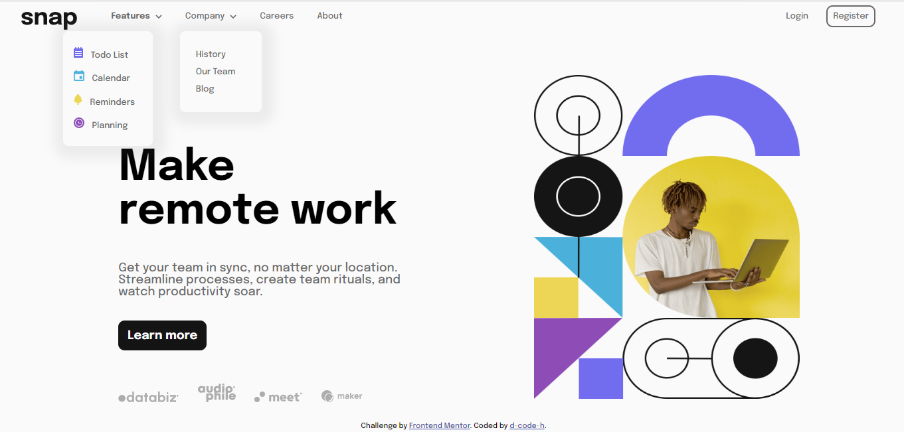
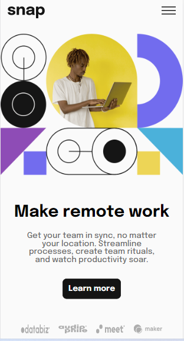
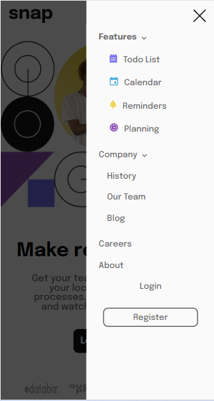

# Frontend Mentor - Intro section with dropdown navigation solution

This is a solution to the [Intro section with dropdown navigation challenge on Frontend Mentor](https://www.frontendmentor.io/challenges/intro-section-with-dropdown-navigation-ryaPetHE5). Frontend Mentor challenges help you improve your coding skills by building realistic projects.

## Table of contents

- [Overview](#overview)
  - [The challenge](#the-challenge)
  - [Screenshot](#screenshot)
  - [Links](#links)
- [My process](#my-process)
  - [Built with](#built-with)
  - [What I learned](#what-i-learned)
  - [Continued development](#continued-development)
  - [Useful resources](#useful-resources)
- [Author](#author)
- [Acknowledgments](#acknowledgments)

## Overview

### The challenge

Users should be able to:

- View the relevant dropdown menus on desktop and mobile when interacting with the navigation links
- View the optimal layout for the content depending on their device's screen size
- See hover states for all interactive elements on the page

### Screenshot


Desktop Version

Mobile Version

Mobile Expanded Version

### Links

- Solution URL: [Github](https://github.com/d-code-h/intro-section-with-dropdown-navigation-main)
- Live Site URL: [Netlify](https://starlit-centaur-4fd6a0.netlify.app/)

## My process

### Built with

- Semantic HTML5 markup
- CSS custom properties
- Flexbox

### What I learned

In the process of developing this project, i felt inlove with the responsive menu. Felt i did something great. LOL

```html
<header>
  
  <div id="container">
    <div id="full__menu">
      <nav>
        <ul>
          <li class="menu">
            <a class="active" href="#"
              >Features
              
            </a>

            <div id="features" class="submenu">
              <ul>
                <li>
                  <a href="#">
                    
                    <span> Todo List </span>
                  </a>
                </li>
                <li>
                  <a href="#">
                    
                    <span> Calendar </span>
                  </a>
                </li>
                <li>
                  <a href="#">
                    
                    <span>Reminders</span>
                  </a>
                </li>
                <li>
                  <a href="#">
                    
                    <span>Planning</span>
                  </a>
                </li>
              </ul>
            </div>
          </li>
          <li class="menu">
            <a href="#"
              >Company </a>
            <div id="company" class="submenu">
              <ul>
                <li>
                  <a href="#"> History</a>
                </li>
                <li>
                  <a href="#"> Our Team</a>
                </li>
                <li>
                  <a href="#"> Blog</a>
                </li>
              </ul>
            </div>
          </li>
          <li><a href="#">Careers</a></li>
          <li><a href="#">About</a></li>
        </ul>
      </nav>
      <aside role="form">
        <ul>
          <li><a href="#">Login</a></li>
          <li><a href="#">Register</a></li>
        </ul>
      </aside>
    </div>
  </div>

  
</header>
```

```css
header {
  font-size: 0.8rem;
  margin: 1rem;
  display: contents;
}
header #container {
  display: contents;
}

#full__menu {
  display: contents;
  width: 70%;
}

.submenu {
  margin-top: 1rem;
  padding: 0.2rem 0;
  text-align: center;
  display: none;
  position: absolute;
  background-color: var(--tertiary-color);
  box-shadow: 0.2rem 0.2rem 1rem 1rem rgba(105, 105, 105, 0.1);
  border-radius: 0.5rem;
}
```

```js
document.getElementById("menu-img").addEventListener("click", function () {
  let src = this.src;
  if (src.includes("close")) {
    this.src = "./images/icon-menu.svg";
    document.querySelector("header #container").style.display = "none";
    document.getElementById("transparent").style.display = "none";
  } else {
    this.src = "./images/icon-close-menu.svg";
    document.getElementById("transparent").style.display = "block";
    document.querySelector("header #container").style.display = "contents";
  }
});
```

### Continued development

I look forward strengthen my css and javascripts skills more while working heavily with libraries involving both.

### Useful resources

- [Epilogue](https://fonts.google.com/specimen/Epilogue) - Font Family used for this project.
- [Netlify](https://www.netlify.com/) - Really helpful in bringing this project online.
- [FrontendMentor](https://www.frontendmentor.io) - Very useful to get startup projects.

## Author

- Github - [d-code-h](https://github.com/d-code-h)
- Frontend Mentor - [@d-code-h](https://www.frontendmentor.io/profile/d-code-h)
- Email - [@Office Mail](habeebdh1@outlook.com)

## Acknowledgments

My profound gratitude goes to Frontend Mentor. You are the best guys. Also an heart of love for everyone out there thriving hard to make resources excessiively available online.
❤️❤️❤️
